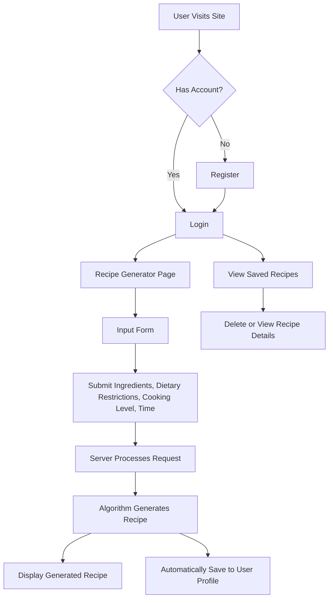

# 🍳 MealmakerAI – AI Recipe Generator

**MealmakerAI** is a full-stack web application developed during my internship at **Quantum Learnings**.  
It allows users to generate personalized recipes based on the ingredients they have, cooking time, skill level, and dietary preferences. The system uses the **Gemini API** for recipe generation and includes features like user authentication, recipe storage, and management.

---

## 📚 Internship Context

This project was built during a 3-month internship focused on **full-stack web development**.  
Throughout the internship, I gained hands-on experience in:

- Frontend: HTML, CSS, Tailwind CSS, JavaScript & DOM manipulation  
- Backend: Node.js, Express.js  
- Database: MongoDB Atlas  
- API Integration: Gemini API  
- Deployment: Render  
- Software Development: Project planning, testing, and deployment

This experience enhanced my ability to build scalable applications, integrate AI services, and deploy complete web apps.

---

## 🔁 User Flow Diagram



---

## ✨ Key Features

- 🔐 **Authentication**: Secure user registration and login with session handling  
- 🧠 **AI Recipe Generation**: Personalized recipe creation using the Gemini API  
- 📥 **User Input Form**: Collects ingredients, cooking time, skill level, and dietary restrictions  
- 💾 **Recipe Storage**: Saves generated recipes to the user’s MongoDB profile  
- 🗑️ **Manage Recipes**: Users can delete or view previously saved recipes  
- 💻 **Responsive Design**: Built with Tailwind CSS for mobile-friendly UI  
- 🚀 **Live Deployment**: Hosted on Render for global accessibility  

---

## 🛠 Tech Stack

| Layer       | Technology                        |
|-------------|-----------------------------------|
| Frontend    | HTML, CSS, Tailwind CSS, JavaScript |
| Backend     | Node.js, Express.js               |
| AI Service  | Gemini API                        |
| Database    | MongoDB Atlas                     |
| Deployment  | Render                            |

---

## 🧪 How to Run Locally

### 1. Clone the Repository

```bash
git clone https://github.com/yourusername/mealmakerai.git
cd mealmakerai
```

### 2. Install Dependencies

```bash
npm install
```

### 3. Configure Environment Variables

Create a `.env` file in the root directory and add:

```ini
MONGODB_URI=your_mongo_db_uri  
SESSION_SECRET=your_session_secret  
GEMINI_API_KEY=your_gemini_api_key
```

### 4. Start the Server

```bash
node server.js
```

### 5. Open in Browser

Visit: [http://localhost:3000](http://localhost:3000)

---

## 📈 Real-World Impact

- Encourages smarter food planning and reduces kitchen waste  
- Helps users, especially busy individuals, come up with meal ideas quickly  
- Demonstrates practical AI integration for daily life  
- Strong portfolio addition for full-stack web development

---

## 🧠 Skills Gained

- API integration & asynchronous request handling  
- User authentication & session management  
- RESTful routing with Express.js  
- Responsive UI design with Tailwind CSS  
- Cloud database usage with MongoDB Atlas  
- Full-stack app development & deployment

---

## 🙌 Acknowledgements

- **Quantum Learnings** – for structured mentorship and training  
- **Mentors and Reviewers** – for continuous feedback and support  
- **Gemini API** – for powering AI-generated recipes  
- **Render** – for effortless app hosting and deployment  

---
